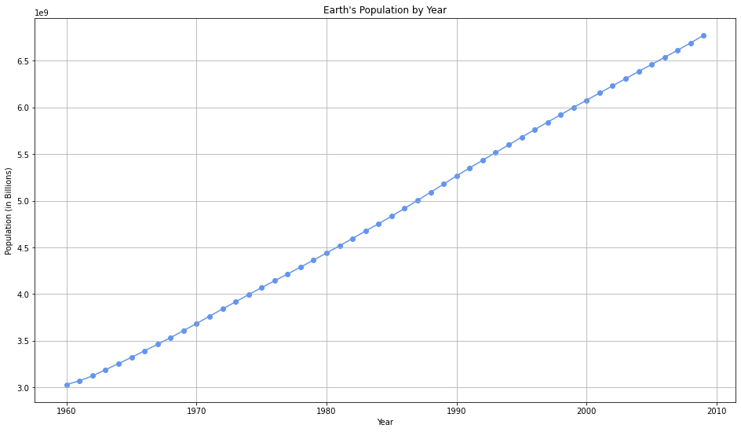

##########################################################
#### File: RattanavilayThip_Weeks_1 _&_2_Exercises<br>
#### Name: Thip Rattanavilay<br>
#### Date: 03/25/2021<br>
#### Course: DSC 540 - Weeks 1 & 2 Exercises<br>
##########################################################


```python
import pandas as pd
import numpy as np
import random as rd
import matplotlib.pyplot as plt
from IPython.core.display import display, HTML
```

# 1. Create a Jupyter notebook where you create a list, iterate over the list and sort your results, generate random numbers, add to the list, and then print your results.


## A. Create a list


```python
my_list = [1, 2, 3, 4, 5, 6, 7, 8, 9, 10, 11, 12, 13, 14, 15, 16, 17, 18, 19, 20]
my_list
```


    [1, 2, 3, 4, 5, 6, 7, 8, 9, 10, 11, 12, 13, 14, 15, 16, 17, 18, 19, 20]


## B. Iterate over the list to sort your results


```python
for i in np.arange(0, len(my_list)):
    key = my_list[i] 
    j = i-1
    while j >=0 and key < my_list[j] : 
            my_list[j+1] = my_list[j] 
            j += -1
    my_list[j+1] = key 
        
print(my_list)
```

    [1, 2, 3, 4, 5, 6, 7, 8, 9, 10, 11, 12, 13, 14, 15, 16, 17, 18, 19, 20]


## C. Generate random numbers


```python
rand_nums = [rd.randint(1,20) for i  in range(0,10)]

print(rand_nums)
```

    [20, 12, 11, 6, 19, 4, 10, 4, 19, 12]


## D. Add to the list, and then print your results.**


```python
my_list = my_list + rand_nums
print(my_list)
```

    [1, 2, 3, 4, 5, 6, 7, 8, 9, 10, 11, 12, 13, 14, 15, 16, 17, 18, 19, 20, 20, 12, 11, 6, 19, 4, 10, 4, 19, 12]


# 2. Create a line chart with Matplotlib and the following data file


```python
df = pd.read_excel("world-population.xlsm")
df.head()
```


<div>
<style scoped>
    .dataframe tbody tr th:only-of-type {
        vertical-align: middle;
    }

    .dataframe tbody tr th {
        vertical-align: top;
    }

    .dataframe thead th {
        text-align: right;
    }
</style>
<table border="1" class="dataframe">
  <thead>
    <tr style="text-align: right;">
      <th></th>
      <th>Year</th>
      <th>Population</th>
    </tr>
  </thead>
  <tbody>
    <tr>
      <th>0</th>
      <td>1960</td>
      <td>3028654024</td>
    </tr>
    <tr>
      <th>1</th>
      <td>1961</td>
      <td>3068356747</td>
    </tr>
    <tr>
      <th>2</th>
      <td>1962</td>
      <td>3121963107</td>
    </tr>
    <tr>
      <th>3</th>
      <td>1963</td>
      <td>3187471383</td>
    </tr>
    <tr>
      <th>4</th>
      <td>1964</td>
      <td>3253112403</td>
    </tr>
  </tbody>
</table>
</div>


```python
plt.figure(figsize=(16, 9))
plt.plot(df['Year'], df['Population'], color = "cornflowerblue")
plt.scatter(df['Year'], df['Population'], color = "cornflowerblue");
plt.title("Earth's Population by Year")
plt.xlabel("Year")
plt.grid()
plt.ylabel("Population (in Billions)");
```


    

    


# 3. Complete the following activities

# Activity 1: Handling Lists
In this activity, we will generate a **list** of random numbers and then generate another **list** from the first one, which only contain numbers that are divisible by three. Repeat the experiment three times Then, we will calculate the average difference of length between the two lists. <br><br> These are the steps for completing this activity:

### 1. Create a `list` of 100 random numbers


```python
## Return a list of random numbers. Default is 100.

def generate_random_numbers(l = 100):
    
    random_numbers = [rd.randint(1,100) for i in range(0,l)]
    return random_numbers

rand_nums = generate_random_numbers()
print(rand_nums)
```

    [14, 93, 68, 70, 36, 18, 4, 83, 11, 56, 61, 97, 62, 85, 93, 13, 25, 24, 94, 21, 24, 91, 81, 4, 24, 72, 57, 9, 77, 26, 2, 20, 18, 42, 81, 13, 3, 93, 11, 88, 71, 9, 62, 2, 10, 5, 55, 27, 85, 18, 19, 52, 70, 39, 75, 81, 27, 28, 2, 61, 53, 87, 13, 17, 74, 43, 77, 94, 5, 43, 51, 34, 47, 61, 20, 11, 21, 73, 52, 24, 73, 19, 35, 58, 46, 18, 86, 29, 84, 71, 41, 60, 60, 90, 22, 97, 90, 9, 95, 42]


### 2.  Create a new `list` from this random `list`, with numbers that are divisible by 3.


```python
## Intakes a list and returns a new list containing only values in the original list that are divisible by three


def divisible_by_three(arr):
    new_list = []
    for i in arr:
        if i % 3 == 0:
            new_list.append(i)
    return new_list

new_list = divisible_by_three(rand_nums)
print(new_list)
```

    [39, 75, 51, 27, 84, 87, 84, 18, 93, 18, 54, 21, 39, 87, 90, 18, 75, 78, 42, 48, 75, 87, 51, 42, 69, 42, 93, 72, 18, 15, 60, 84, 39]


### 3. Calculate the length of these two lists and store the difference in a new variable


```python
len_rand_list = len(rand_nums)
len_new_list = len(new_list)
list_diff = len_rand_list - len_new_list


print("Random Number List Length: {}".format(len_rand_list))
print("New List Length: {}".format(len_new_list))
print("Diff is: {}".format(list_diff))
```

    Random Number List Length: 100
    New List Length: 33
    Diff is: 67


### 4. Using a loop, perform steps 2 and 3 and find the difference variable three times


```python
## In order to get different results, I'll need to regenerate the random numbers list, 
## else I'll just get the same return

runs = 3

diff_list_len = []

for i in range(0,runs):
    first_list = generate_random_numbers()
    second_list = divisible_by_three(first_list)
    diff_list_len.append(len(first_list) - len(second_list))

print("Diff List: {}".format(diff_list_len))
```

    Diff List: [67, 67, 67]


### 5. Find the arithmetic mean of these three difference values


```python
def mean(arr, digits = 2):
    """Calculates the arithmetic mean of an array"""
    summer = 0
    for i in arr:
        summer += i
    return round(summer/len(arr), digits)

mean(diff_list_len)
```


    67.0


# Activity 2: Analyze a Multiline String and Generate the Unique Word Count

This section will ensure that you have understood the various basic data structrues and their manipulation. We will do that by going though an activity that has been designed specifically for this purpose:
<br>
<br>
In this activity, we will do the following:

- Get multiline text and save it in a Python variable <br>

- Get rid of all new lines in it using string methods<br>

- Get all the unique words and their occurences from the string <br>

- Repeat the step to find all unique words and occurrences, without considering case sensitivity <br>

> **Note** <br>
>For the sake of simpliity for this activity, the original text (which can  be found at https://www.gutenberg.org/files/1342/1342-h/1342-h.htm) has been pre-processed a bit

# These are the steps to guide you through solving this activity:<br>
### 1. Create a `multiline_text` variable by copying the text from the first chapter of *Pride and Prejudice.

>**Note**<br>
The first chapter of *Pride and Prejudice* by Jane Austen has been made available on the GitHub repository at http://github.com/TrainingByPackt/Data-Wrangling-with-Python/blob/master/Chapter01/Activity02/


```python
## importing string

import string
```


```python
## Pride and Prejudice by Jane Austen 
## Pulled from this URL - https://www.gutenberg.org/files/1342/1342-h/1342-h.htm#link2HCH0001


multiline_text = """It is a truth universally acknowledged, that a single man in possession of a good fortune, must be in want of a wife. 

However little known the feelings or views of such a man may be on his first entering a neighbourhood, this truth is so well fixed in the minds of the surrounding families, that he is considered the rightful property of some one or other of their daughters.

"My dear Mr. Bennet," said his lady to him one day, "have you heard that Netherfield Park is let at last?"

Mr. Bennet replied that he had not.

"But it is," returned she; "for Mrs. Long has just been here, and she told me all about it."

Mr. Bennet made no answer.

"Do you not want to know who has taken it?" cried his wife impatiently.

"You want to tell me, and I have no objection to hearing it."

This was invitation enough.

"Why, my dear, you must know, Mrs. Long says that Netherfield is taken by a young man of large fortune from the north of England; that he came down on Monday in a chaise and four to see the place, and was so much delighted with it, that he agreed with Mr. Morris immediately; that he is to take possession before Michaelmas, and some of his servants are to be in the house by the end of next week."

"What is his name?"

"Bingley."

"Is he married or single?"

"Oh! Single, my dear, to be sure! A single man of large fortune; four or five thousand a year. What a fine thing for our girls!"

"How so? How can it affect them?"

"My dear Mr. Bennet," replied his wife, "how can you be so tiresome! You must know that I am thinking of his marrying one of them."

"Is that his design in settling here?"

"Design! Nonsense, how can you talk so! But it is very likely that he may fall in love with one of them, and therefore you must visit him as soon as he comes."

"I see no occasion for that. You and the girls may go, or you may send them by themselves, which perhaps will be still better, for as you are as handsome as any of them, Mr. Bingley may like you the best of the party."

"My dear, you flatter me. I certainly have had my share of beauty, but I do not pretend to be anything extraordinary now. When a woman has five grown-up daughters, she ought to give over thinking of her own beauty."

"In such cases, a woman has not often much beauty to think of."

"But, my dear, you must indeed go and see Mr. Bingley when he comes into the neighbourhood."

"It is more than I engage for, I assure you."

"But consider your daughters. Only think what an establishment it would be for one of them. Sir William and Lady Lucas are determined to go, merely on that account, for in general, you know, they visit no newcomers. Indeed you must go, for it will be impossible for us to visit him if you do not."

"You are over-scrupulous, surely. I dare say Mr. Bingley will be very glad to see you; and I will send a few lines by you to assure him of my hearty consent to his marrying whichever he chooses of the girls; though I must throw in a good word for my little Lizzy."

"I desire you will do no such thing. Lizzy is not a bit better than the others; and I am sure she is not half so handsome as Jane, nor half so good-humoured as Lydia. But you are always giving her the preference."

"They have none of them much to recommend them," replied he; "they are all silly and ignorant like other girls; but Lizzy has something more of quickness than her sisters."

"Mr. Bennet, how can you abuse your own children in such a way? You take delight in vexing me. You have no compassion for my poor nerves."

"You mistake me, my dear. I have a high respect for your nerves. They are my old friends. I have heard you mention them with consideration these last twenty years at least."

"Ah, you do not know what I suffer."

"But I hope you will get over it, and live to see many young men of four thousand a year come into the neighbourhood."
""
"It will be no use to us, if twenty such should come, since you will not visit them."

"Depend upon it, my dear, that when there are twenty, I will visit them all."

Mr. Bennet was so odd a mixture of quick parts, sarcastic humour, reserve, and caprice, that the experience of three-and-twenty years had been insufficient to make his wife understand his character. Her mind was less difficult to develop. She was a woman of mean understanding, little information, and uncertain temper. When she was discontented, she fancied herself nervous. The business of her life was to get her daughters married; its solace was visiting and news. """
```

### 2. Find the type and length of the `multiline_text` string using the commands `type` and `len`


```python
type(multiline_text)
```


    str


```python
len(multiline_text)
```


    4478


### 3. Remove all new lines and symbols using the `replace` function.


```python
multiline_text = multiline_text.replace("\n", " ")
multiline_text = multiline_text.translate(multiline_text.maketrans("", "", string.punctuation))#.lower()

multiline_text[:116]
```


    'It is a truth universally acknowledged that a single man in possession of a good fortune must be in want of a wife  '


### 4. Find all the words in `multiline_text` using the `split` function.**


```python
multiline_text = multiline_text.split(" ")
multiline_text = [i for i in multiline_text if i]
print(multiline_text[:26])
```

    ['It', 'is', 'a', 'truth', 'universally', 'acknowledged', 'that', 'a', 'single', 'man', 'in', 'possession', 'of', 'a', 'good', 'fortune', 'must', 'be', 'in', 'want', 'of', 'a', 'wife', 'However', 'little', 'known']


### 5. Create a list from this list that will contain only the unique words.**


```python
new_list = []
for i in multiline_text:
    if i not in new_list:
        new_list.append(i)
```


```python
# We can compare the list to the set which removes all duplicate values to verify our method worked
len(new_list) == len(set(multiline_text))
```


    True


### 6. Count the number of times the unique word has appeared in the list using the `key` and `value` in `dict`**


```python
word_dictionary = dict()

for word in multiline_text:
    if word in word_dictionary:
        word_dictionary[word] += 1
    else:
        word_dictionary[word] = 1
```

### 7. Find the top 25 words from the unique words that you have found using the `slice` function**<br>

You just created, step by step, a unique word counter using all the neat tricks that you learned about in this chapter.


```python
# I have no idea how slice is suppose to work for this exercise. The solution doesn't even use it

print("-" * 35)
print("|{:^33}|".format("Pride and Prejudice"))
print("-" * 35)
for index, key in enumerate(sorted(word_dictionary, key=word_dictionary.get, reverse=True),start = 1):
    print("| {:>5} | {:15}|{:>7} |".format(index, key, word_dictionary[key]))
    if index == 25:
        break
print("-" * 35)
```

    -----------------------------------
    |       Pride and Prejudice       |
    -----------------------------------
    |     1 | of             |     29 |
    |     2 | you            |     24 |
    |     3 | to             |     22 |
    |     4 | a              |     20 |
    |     5 | the            |     17 |
    |     6 | I              |     17 |
    |     7 | and            |     16 |
    |     8 | that           |     15 |
    |     9 | is             |     12 |
    |    10 | for            |     12 |
    |    11 | in             |     11 |
    |    12 | be             |     11 |
    |    13 | his            |     11 |
    |    14 | he             |     11 |
    |    15 | it             |     11 |
    |    16 | them           |     11 |
    |    17 | Mr             |     10 |
    |    18 | my             |     10 |
    |    19 | not            |      9 |
    |    20 | will           |      9 |
    |    21 | so             |      8 |
    |    22 | dear           |      8 |
    |    23 | was            |      8 |
    |    24 | are            |      8 |
    |    25 | must           |      7 |
    -----------------------------------


# Activity 3: Permutation, Iterator, Lambda LIst<br>
In this activity, we will be using **permutations** to generate all possible three-digit numbers that can be generated using 0, 1, and 2. Then, loop over this iterator, and also use `isinstance` and `assert` to make sure that the return types are tuples. Also, use a signle line of code involving `dropwhile` and `lambda` expressions to convert all the tuples to lists while dropping an leading zeros (for example, (0,1,2) becomes [1, 2]). Finally, write a function that takes a list like b efore and returns the actual number contained in it.<br>

These steps will guide you to solve this activity:

### 1. Look up the definitions of `permutation` and `dropwhile` from itertools


```python
from itertools import permutations, dropwhile
```


```python
?permutations
```

**Init signature:** permutations(iterable, r=None)

**Docstring:**     
Return successive r-length permutations of elements in the iterable.


```python
?dropwhile
```

**Init signature:** dropwhile(predicate, iterable, /)

**Docstring:**     
Drop items from the iterable while predicate(item) is true.

### 2. Write and expression to generate all the possible three-digit numbers using 0, 1, and 2.


```python
def number_combiner(arr):
    nums = permutations(arr, len(arr)) 
    num_list = [i for i in nums]
    return num_list
```


```python
my_nums = [0, 1, 2]
number_combiner(my_nums)
```


    [(0, 1, 2), (0, 2, 1), (1, 0, 2), (1, 2, 0), (2, 0, 1), (2, 1, 0)]


### 3. Loop over the iterator expression you generated before. Print each element that's returned by the iterator. Use `assert` and ` isinstance` to make sure that the elements are of the tuple type


```python
for i in number_combiner(my_nums):
    assert type(i) == tuple
    print("| {:>7} | {:>10} | {:>5} |".format(str(i), str(type(i)), str(isinstance(i, tuple))))
```

    | (0, 1, 2) | <class 'tuple'> |  True |
    | (0, 2, 1) | <class 'tuple'> |  True |
    | (1, 0, 2) | <class 'tuple'> |  True |
    | (1, 2, 0) | <class 'tuple'> |  True |
    | (2, 0, 1) | <class 'tuple'> |  True |
    | (2, 1, 0) | <class 'tuple'> |  True |


### 4. Write the loop again using `dropwhile` with a lambda expression to drop any leading zeros from the tuples. As an example, (0, 1, 2) will become (1, 2). Also, cast the output of dropwhile to a list.


```python
x = lambda x: x == 0, i
x
```


    (<function __main__.<lambda>(x)>, (2, 1, 0))


```python
for i in number_combiner(my_nums):
    adj_list = list(dropwhile(lambda x: x == 0, i))
    print("| {:^10} | {:>10} | {:>5} |".format(str(adj_list), 
                                              str(type(adj_list)), 
                                              str(isinstance(adj_list, list))))
```

    |   [1, 2]   | <class 'list'> |  True |
    |   [2, 1]   | <class 'list'> |  True |
    | [1, 0, 2]  | <class 'list'> |  True |
    | [1, 2, 0]  | <class 'list'> |  True |
    | [2, 0, 1]  | <class 'list'> |  True |
    | [2, 1, 0]  | <class 'list'> |  True |


### 5. Check the actual type that `dropwhile` returns


```python
print(type(dropwhile(1,[1,2])))
```

    <class 'itertools.dropwhile'>


### 6. Combine the preceding code into one block, and this time write a separate function where you will pass the list generated from `dropwhile`, and the function will return the whole number contained in the list. As an example, if you pass [1, 2] to the function, it will return 12. Make sure that the return type is indeed a number and not a string. Although, this task can be achieved using other tricks, we require that you treat the incoming list as a stack in the function and generate the number by reading the individual digits from the stack.


```python
# Using String Concatenation

for i in number_combiner(my_nums):
    adj_list = list(dropwhile(lambda x: x <= 0, i)) #  drop all the leading zeros
    new_nums = []  # Create a new list for the merged numbers
    temp_string = "" #  Create an empty string to start merging numbers together
    for j in adj_list:  # Iterate over the new list
        temp_string += str(j)  # Add the string version of our integer to the string (needs to be string to avoid addition)
    temp_string = int(temp_string) # Convert the string back into an integer
    new_nums.append(temp_string) # Add the integer to the new list
    print("| {:^10} | {:>10} | {:>5} |".format(str(temp_string), 
                                              str(type(temp_string)), 
                                              str(isinstance(temp_string, int))))
```

    |     12     | <class 'int'> |  True |
    |     21     | <class 'int'> |  True |
    |    102     | <class 'int'> |  True |
    |    120     | <class 'int'> |  True |
    |    201     | <class 'int'> |  True |
    |    210     | <class 'int'> |  True |


```python
## importing math package

import math

for i in number_combiner(my_nums):
    adj_list = list(dropwhile(lambda x: x <= 0, i)) #  drop all the leading zeros
    new_nums = []  # Create a new list for the merged numbers
    summer = 0 # Init a variable to sum to
    for ind, j in enumerate(adj_list[::-1]):  # Iterate over the the reversed list with enumeration
        summer += int((math.pow(10,ind)*j)) # Use pow to increase to add a power of ten to each value passed and add it to the summer
    new_nums.append(summer) # Add the integer to the new list
    print("| {:^10} | {:>10} | {:>5} |".format(str(summer), 
                                              str(type(temp_string)), 
                                              str(isinstance(temp_string, int))))
```

    |     12     | <class 'int'> |  True |
    |     21     | <class 'int'> |  True |
    |    102     | <class 'int'> |  True |
    |    120     | <class 'int'> |  True |
    |    201     | <class 'int'> |  True |
    |    210     | <class 'int'> |  True |


# Activity 4: Design Your Own CSV Parser<br>
A CSV file is something you will encounter a lot in your life as a data practitioner. A CSV is a comma-separated file where data from a tabilar format is generally stored and separated using commas, although other characters can also be used.

In this activity, we will be tasked with building our own CSV reader and parser. Although it's a big task if we try to cover all use cases and edge cases, along with escape characters and all, for the sake of this small activity, we will keep our requirements small. We will assume that there is no escape character, meaning that if you use a comma at any place in your row, it means you are starting a new column. We will also assume that the only function we are interested in is to be able to read a CSV file line by line where each read will generate a new dict with the column names as keys and row anmes as values.

Here is an example. 


We can convert the data in the preceding table into a Python dictionary, which would look as follows: `{"Name": "Bob", "Age": "24", "Location": "California"}:`


```python
our_dict = {"Name":"Bob", "Age":"24", "Location":"California"}
our_dict
```


    {'Name': 'Bob', 'Age': '24', 'Location': 'California'}


### 1. Import `zip_longest` from itertools. Create a function to zip `header`, `line` and `fillvalue=None`**


```python
from itertools import zip_longest
```


```python
def zipper(header, line):
    zipped_line = zip_longest(header, line, fillvalue=None)
    return_dict = dict()
    for key, value in zipped_line:
        return_dict[key] = value
    return return_dict
```

### 2. Open the accompanying `sales_record.csv` file from the Github link by using `r` mode inside a with block and first check that it is opened**


```python
with open("sales_record.csv", "r") as file:
    for i, line in enumerate(file):
        print(line)
        if i > 10:
            break
```

    Region,Country,Item Type,Sales Channel,Order Priority,Order Date,Order ID,Ship Date,Units Sold,Unit Price,Unit Cost,Total Revenue,Total Cost,Total Profit
    
    Central America and the Caribbean,Antigua and Barbuda ,Baby Food,Online,M,12/20/2013,957081544,1/11/2014,552,255.28,159.42,140914.56,87999.84,52914.72
    
    Central America and the Caribbean,Panama,Snacks,Offline,C,7/5/2010,301644504,7/26/2010,2167,152.58,97.44,330640.86,211152.48,119488.38
    
    Europe,Czech Republic,Beverages,Offline,C,9/12/2011,478051030,9/29/2011,4778,47.45,31.79,226716.10,151892.62,74823.48
    
    Asia,North Korea,Cereal,Offline,L,5/13/2010,892599952,6/15/2010,9016,205.70,117.11,1854591.20,1055863.76,798727.44
    
    Asia,Sri Lanka,Snacks,Offline,C,7/20/2015,571902596,7/27/2015,7542,152.58,97.44,1150758.36,734892.48,415865.88
    
    Middle East and North Africa,Morocco,Personal Care,Offline,L,11/8/2010,412882792,11/22/2010,48,81.73,56.67,3923.04,2720.16,1202.88
    
    Australia and Oceania,Federated States of Micronesia,Clothes,Offline,H,3/28/2011,932776868,5/10/2011,8258,109.28,35.84,902434.24,295966.72,606467.52
    
    Europe,Bosnia and Herzegovina,Clothes,Online,M,10/14/2013,919133651,11/4/2013,927,109.28,35.84,101302.56,33223.68,68078.88
    
    Middle East and North Africa,Afghanistan,Clothes,Offline,M,8/27/2016,579814469,10/5/2016,8841,109.28,35.84,966144.48,316861.44,649283.04
    
    Sub-Saharan Africa,Ethiopia,Baby Food,Online,M,4/13/2015,192993152,5/7/2015,9817,255.28,159.42,2506083.76,1565026.14,941057.62
    
    Middle East and North Africa,Turkey,Office Supplies,Offline,C,9/25/2013,557156026,10/15/2013,3704,651.21,524.96,2412081.84,1944451.84,467630.00
    


### 3. Read the first line and use string methods to generate a list of all column names


```python
with open("sales_record.csv", "r") as file:
    column_names = file.readline()
    column_names = column_names.replace("\n", "").split(",")
    print(column_names)
```

    ['Region', 'Country', 'Item Type', 'Sales Channel', 'Order Priority', 'Order Date', 'Order ID', 'Ship Date', 'Units Sold', 'Unit Price', 'Unit Cost', 'Total Revenue', 'Total Cost', 'Total Profit']


### 4. Start reading the file. Read it line by line.**


```python
#display(HTML("<style>.container { width:210% !important; }</style>"))
```


```python
with open("sales_record.csv", "r") as file:
    column_names = file.readline()
    column_names = column_names.replace("\n", "").split(",")
    print(column_names)
    for i, line in enumerate(file):
        print(line)
        if i > 20:
            break
```

    ['Region', 'Country', 'Item Type', 'Sales Channel', 'Order Priority', 'Order Date', 'Order ID', 'Ship Date', 'Units Sold', 'Unit Price', 'Unit Cost', 'Total Revenue', 'Total Cost', 'Total Profit']
    Central America and the Caribbean,Antigua and Barbuda ,Baby Food,Online,M,12/20/2013,957081544,1/11/2014,552,255.28,159.42,140914.56,87999.84,52914.72
    
    Central America and the Caribbean,Panama,Snacks,Offline,C,7/5/2010,301644504,7/26/2010,2167,152.58,97.44,330640.86,211152.48,119488.38
    
    Europe,Czech Republic,Beverages,Offline,C,9/12/2011,478051030,9/29/2011,4778,47.45,31.79,226716.10,151892.62,74823.48
    
    Asia,North Korea,Cereal,Offline,L,5/13/2010,892599952,6/15/2010,9016,205.70,117.11,1854591.20,1055863.76,798727.44
    
    Asia,Sri Lanka,Snacks,Offline,C,7/20/2015,571902596,7/27/2015,7542,152.58,97.44,1150758.36,734892.48,415865.88
    
    Middle East and North Africa,Morocco,Personal Care,Offline,L,11/8/2010,412882792,11/22/2010,48,81.73,56.67,3923.04,2720.16,1202.88
    
    Australia and Oceania,Federated States of Micronesia,Clothes,Offline,H,3/28/2011,932776868,5/10/2011,8258,109.28,35.84,902434.24,295966.72,606467.52
    
    Europe,Bosnia and Herzegovina,Clothes,Online,M,10/14/2013,919133651,11/4/2013,927,109.28,35.84,101302.56,33223.68,68078.88
    
    Middle East and North Africa,Afghanistan,Clothes,Offline,M,8/27/2016,579814469,10/5/2016,8841,109.28,35.84,966144.48,316861.44,649283.04
    
    Sub-Saharan Africa,Ethiopia,Baby Food,Online,M,4/13/2015,192993152,5/7/2015,9817,255.28,159.42,2506083.76,1565026.14,941057.62
    
    Middle East and North Africa,Turkey,Office Supplies,Offline,C,9/25/2013,557156026,10/15/2013,3704,651.21,524.96,2412081.84,1944451.84,467630.00
    
    Middle East and North Africa,Oman,Cosmetics,Online,M,5/12/2013,741101920,5/17/2013,7382,437.20,263.33,3227410.40,1943902.06,1283508.34
    
    Asia,Malaysia,Cereal,Offline,L,7/31/2016,333942162,8/25/2016,9762,205.70,117.11,2008043.40,1143227.82,864815.58
    
    Central America and the Caribbean,Saint Lucia,Cosmetics,Offline,H,7/6/2015,795100581,7/16/2015,6786,437.20,263.33,2966839.20,1786957.38,1179881.82
    
    Central America and the Caribbean,Saint Vincent and the Grenadines,Baby Food,Online,L,11/28/2010,504313504,12/3/2010,6428,255.28,159.42,1640939.84,1024751.76,616188.08
    
    Middle East and North Africa,Lebanon,Meat,Offline,H,12/17/2015,611629760,1/31/2016,3693,421.89,364.69,1558039.77,1346800.17,211239.60
    
    Europe,Austria,Cereal,Offline,C,8/13/2014,987410676,9/6/2014,5616,205.70,117.11,1155211.20,657689.76,497521.44
    
    Europe,Bulgaria,Office Supplies,Online,L,10/31/2010,672330081,11/29/2010,6266,651.21,524.96,4080481.86,3289399.36,791082.50
    
    North America,Mexico,Beverages,Online,C,3/13/2017,127374303,3/20/2017,1742,47.45,31.79,82657.90,55378.18,27279.72
    
    Central America and the Caribbean,Trinidad and Tobago,Baby Food,Offline,C,4/16/2013,783842170,6/1/2013,5172,255.28,159.42,1320308.16,824520.24,495787.92
    
    Middle East and North Africa,Libya,Beverages,Offline,L,1/18/2010,993345010,3/3/2010,1718,47.45,31.79,81519.10,54615.22,26903.88
    
    Middle East and North Africa,Algeria,Baby Food,Offline,M,9/5/2015,977806651,10/14/2015,3572,255.28,159.42,911860.16,569448.24,342411.92
    


```python
with open("sales_record.csv", "r") as file:
    column_names = file.readline()
    column_names = column_names.replace("\n", "").split(",")
    print(str(len(column_names)*" {:<35} |").format(*column_names))
    print(len((str(len(column_names)*" {:^35} |").format(*column_names)))*"-")
    for i, line in enumerate(file):
        print(str(len(column_names)*" {:<35} |").format(*line.replace("\n", "").split(",")))
        if i > 20:
            break
    
```

     Region                              | Country                             | Item Type                           | Sales Channel                       | Order Priority                      | Order Date                          | Order ID                            | Ship Date                           | Units Sold                          | Unit Price                          | Unit Cost                           | Total Revenue                       | Total Cost                          | Total Profit                        |
    ----------------------------------------------------------------------------------------------------------------------------------------------------------------------------------------------------------------------------------------------------------------------------------------------------------------------------------------------------------------------------------------------------------------------------------------------------------------------------------------------------------------------------------------------------
     Central America and the Caribbean   | Antigua and Barbuda                 | Baby Food                           | Online                              | M                                   | 12/20/2013                          | 957081544                           | 1/11/2014                           | 552                                 | 255.28                              | 159.42                              | 140914.56                           | 87999.84                            | 52914.72                            |
     Central America and the Caribbean   | Panama                              | Snacks                              | Offline                             | C                                   | 7/5/2010                            | 301644504                           | 7/26/2010                           | 2167                                | 152.58                              | 97.44                               | 330640.86                           | 211152.48                           | 119488.38                           |
     Europe                              | Czech Republic                      | Beverages                           | Offline                             | C                                   | 9/12/2011                           | 478051030                           | 9/29/2011                           | 4778                                | 47.45                               | 31.79                               | 226716.10                           | 151892.62                           | 74823.48                            |
     Asia                                | North Korea                         | Cereal                              | Offline                             | L                                   | 5/13/2010                           | 892599952                           | 6/15/2010                           | 9016                                | 205.70                              | 117.11                              | 1854591.20                          | 1055863.76                          | 798727.44                           |
     Asia                                | Sri Lanka                           | Snacks                              | Offline                             | C                                   | 7/20/2015                           | 571902596                           | 7/27/2015                           | 7542                                | 152.58                              | 97.44                               | 1150758.36                          | 734892.48                           | 415865.88                           |
     Middle East and North Africa        | Morocco                             | Personal Care                       | Offline                             | L                                   | 11/8/2010                           | 412882792                           | 11/22/2010                          | 48                                  | 81.73                               | 56.67                               | 3923.04                             | 2720.16                             | 1202.88                             |
     Australia and Oceania               | Federated States of Micronesia      | Clothes                             | Offline                             | H                                   | 3/28/2011                           | 932776868                           | 5/10/2011                           | 8258                                | 109.28                              | 35.84                               | 902434.24                           | 295966.72                           | 606467.52                           |
     Europe                              | Bosnia and Herzegovina              | Clothes                             | Online                              | M                                   | 10/14/2013                          | 919133651                           | 11/4/2013                           | 927                                 | 109.28                              | 35.84                               | 101302.56                           | 33223.68                            | 68078.88                            |
     Middle East and North Africa        | Afghanistan                         | Clothes                             | Offline                             | M                                   | 8/27/2016                           | 579814469                           | 10/5/2016                           | 8841                                | 109.28                              | 35.84                               | 966144.48                           | 316861.44                           | 649283.04                           |
     Sub-Saharan Africa                  | Ethiopia                            | Baby Food                           | Online                              | M                                   | 4/13/2015                           | 192993152                           | 5/7/2015                            | 9817                                | 255.28                              | 159.42                              | 2506083.76                          | 1565026.14                          | 941057.62                           |
     Middle East and North Africa        | Turkey                              | Office Supplies                     | Offline                             | C                                   | 9/25/2013                           | 557156026                           | 10/15/2013                          | 3704                                | 651.21                              | 524.96                              | 2412081.84                          | 1944451.84                          | 467630.00                           |
     Middle East and North Africa        | Oman                                | Cosmetics                           | Online                              | M                                   | 5/12/2013                           | 741101920                           | 5/17/2013                           | 7382                                | 437.20                              | 263.33                              | 3227410.40                          | 1943902.06                          | 1283508.34                          |
     Asia                                | Malaysia                            | Cereal                              | Offline                             | L                                   | 7/31/2016                           | 333942162                           | 8/25/2016                           | 9762                                | 205.70                              | 117.11                              | 2008043.40                          | 1143227.82                          | 864815.58                           |
     Central America and the Caribbean   | Saint Lucia                         | Cosmetics                           | Offline                             | H                                   | 7/6/2015                            | 795100581                           | 7/16/2015                           | 6786                                | 437.20                              | 263.33                              | 2966839.20                          | 1786957.38                          | 1179881.82                          |
     Central America and the Caribbean   | Saint Vincent and the Grenadines    | Baby Food                           | Online                              | L                                   | 11/28/2010                          | 504313504                           | 12/3/2010                           | 6428                                | 255.28                              | 159.42                              | 1640939.84                          | 1024751.76                          | 616188.08                           |
     Middle East and North Africa        | Lebanon                             | Meat                                | Offline                             | H                                   | 12/17/2015                          | 611629760                           | 1/31/2016                           | 3693                                | 421.89                              | 364.69                              | 1558039.77                          | 1346800.17                          | 211239.60                           |
     Europe                              | Austria                             | Cereal                              | Offline                             | C                                   | 8/13/2014                           | 987410676                           | 9/6/2014                            | 5616                                | 205.70                              | 117.11                              | 1155211.20                          | 657689.76                           | 497521.44                           |
     Europe                              | Bulgaria                            | Office Supplies                     | Online                              | L                                   | 10/31/2010                          | 672330081                           | 11/29/2010                          | 6266                                | 651.21                              | 524.96                              | 4080481.86                          | 3289399.36                          | 791082.50                           |
     North America                       | Mexico                              | Beverages                           | Online                              | C                                   | 3/13/2017                           | 127374303                           | 3/20/2017                           | 1742                                | 47.45                               | 31.79                               | 82657.90                            | 55378.18                            | 27279.72                            |
     Central America and the Caribbean   | Trinidad and Tobago                 | Baby Food                           | Offline                             | C                                   | 4/16/2013                           | 783842170                           | 6/1/2013                            | 5172                                | 255.28                              | 159.42                              | 1320308.16                          | 824520.24                           | 495787.92                           |
     Middle East and North Africa        | Libya                               | Beverages                           | Offline                             | L                                   | 1/18/2010                           | 993345010                           | 3/3/2010                            | 1718                                | 47.45                               | 31.79                               | 81519.10                            | 54615.22                            | 26903.88                            |
     Middle East and North Africa        | Algeria                             | Baby Food                           | Offline                             | M                                   | 9/5/2015                            | 977806651                           | 10/14/2015                          | 3572                                | 255.28                              | 159.42                              | 911860.16                           | 569448.24                           | 342411.92                           |


```python
# display(HTML("<style>.container { width:56% !important; }</style>"))
```

### 5. Read each line and pass that line to a function along with the list of headers. The work of the function is to construct a dict out of these two and fill up the key/values. Keep in ind that a missing value should results in `None`


```python
with open("sales_record.csv", "r") as file:
    dict_list = []
    column_names = file.readline()
    column_names = column_names.replace("\n", "").split(",")
    for i, line in enumerate(file):
        x = line.replace("\n", "").split(",")
        my_dict = zipper(column_names, x)
        dict_list.append(my_dict)
        if i > 20:
            break
for i in dict_list:
    print(i)
```

    {'Region': 'Central America and the Caribbean', 'Country': 'Antigua and Barbuda ', 'Item Type': 'Baby Food', 'Sales Channel': 'Online', 'Order Priority': 'M', 'Order Date': '12/20/2013', 'Order ID': '957081544', 'Ship Date': '1/11/2014', 'Units Sold': '552', 'Unit Price': '255.28', 'Unit Cost': '159.42', 'Total Revenue': '140914.56', 'Total Cost': '87999.84', 'Total Profit': '52914.72'}
    {'Region': 'Central America and the Caribbean', 'Country': 'Panama', 'Item Type': 'Snacks', 'Sales Channel': 'Offline', 'Order Priority': 'C', 'Order Date': '7/5/2010', 'Order ID': '301644504', 'Ship Date': '7/26/2010', 'Units Sold': '2167', 'Unit Price': '152.58', 'Unit Cost': '97.44', 'Total Revenue': '330640.86', 'Total Cost': '211152.48', 'Total Profit': '119488.38'}
    {'Region': 'Europe', 'Country': 'Czech Republic', 'Item Type': 'Beverages', 'Sales Channel': 'Offline', 'Order Priority': 'C', 'Order Date': '9/12/2011', 'Order ID': '478051030', 'Ship Date': '9/29/2011', 'Units Sold': '4778', 'Unit Price': '47.45', 'Unit Cost': '31.79', 'Total Revenue': '226716.10', 'Total Cost': '151892.62', 'Total Profit': '74823.48'}
    {'Region': 'Asia', 'Country': 'North Korea', 'Item Type': 'Cereal', 'Sales Channel': 'Offline', 'Order Priority': 'L', 'Order Date': '5/13/2010', 'Order ID': '892599952', 'Ship Date': '6/15/2010', 'Units Sold': '9016', 'Unit Price': '205.70', 'Unit Cost': '117.11', 'Total Revenue': '1854591.20', 'Total Cost': '1055863.76', 'Total Profit': '798727.44'}
    {'Region': 'Asia', 'Country': 'Sri Lanka', 'Item Type': 'Snacks', 'Sales Channel': 'Offline', 'Order Priority': 'C', 'Order Date': '7/20/2015', 'Order ID': '571902596', 'Ship Date': '7/27/2015', 'Units Sold': '7542', 'Unit Price': '152.58', 'Unit Cost': '97.44', 'Total Revenue': '1150758.36', 'Total Cost': '734892.48', 'Total Profit': '415865.88'}
    {'Region': 'Middle East and North Africa', 'Country': 'Morocco', 'Item Type': 'Personal Care', 'Sales Channel': 'Offline', 'Order Priority': 'L', 'Order Date': '11/8/2010', 'Order ID': '412882792', 'Ship Date': '11/22/2010', 'Units Sold': '48', 'Unit Price': '81.73', 'Unit Cost': '56.67', 'Total Revenue': '3923.04', 'Total Cost': '2720.16', 'Total Profit': '1202.88'}
    {'Region': 'Australia and Oceania', 'Country': 'Federated States of Micronesia', 'Item Type': 'Clothes', 'Sales Channel': 'Offline', 'Order Priority': 'H', 'Order Date': '3/28/2011', 'Order ID': '932776868', 'Ship Date': '5/10/2011', 'Units Sold': '8258', 'Unit Price': '109.28', 'Unit Cost': '35.84', 'Total Revenue': '902434.24', 'Total Cost': '295966.72', 'Total Profit': '606467.52'}
    {'Region': 'Europe', 'Country': 'Bosnia and Herzegovina', 'Item Type': 'Clothes', 'Sales Channel': 'Online', 'Order Priority': 'M', 'Order Date': '10/14/2013', 'Order ID': '919133651', 'Ship Date': '11/4/2013', 'Units Sold': '927', 'Unit Price': '109.28', 'Unit Cost': '35.84', 'Total Revenue': '101302.56', 'Total Cost': '33223.68', 'Total Profit': '68078.88'}
    {'Region': 'Middle East and North Africa', 'Country': 'Afghanistan', 'Item Type': 'Clothes', 'Sales Channel': 'Offline', 'Order Priority': 'M', 'Order Date': '8/27/2016', 'Order ID': '579814469', 'Ship Date': '10/5/2016', 'Units Sold': '8841', 'Unit Price': '109.28', 'Unit Cost': '35.84', 'Total Revenue': '966144.48', 'Total Cost': '316861.44', 'Total Profit': '649283.04'}
    {'Region': 'Sub-Saharan Africa', 'Country': 'Ethiopia', 'Item Type': 'Baby Food', 'Sales Channel': 'Online', 'Order Priority': 'M', 'Order Date': '4/13/2015', 'Order ID': '192993152', 'Ship Date': '5/7/2015', 'Units Sold': '9817', 'Unit Price': '255.28', 'Unit Cost': '159.42', 'Total Revenue': '2506083.76', 'Total Cost': '1565026.14', 'Total Profit': '941057.62'}
    {'Region': 'Middle East and North Africa', 'Country': 'Turkey', 'Item Type': 'Office Supplies', 'Sales Channel': 'Offline', 'Order Priority': 'C', 'Order Date': '9/25/2013', 'Order ID': '557156026', 'Ship Date': '10/15/2013', 'Units Sold': '3704', 'Unit Price': '651.21', 'Unit Cost': '524.96', 'Total Revenue': '2412081.84', 'Total Cost': '1944451.84', 'Total Profit': '467630.00'}
    {'Region': 'Middle East and North Africa', 'Country': 'Oman', 'Item Type': 'Cosmetics', 'Sales Channel': 'Online', 'Order Priority': 'M', 'Order Date': '5/12/2013', 'Order ID': '741101920', 'Ship Date': '5/17/2013', 'Units Sold': '7382', 'Unit Price': '437.20', 'Unit Cost': '263.33', 'Total Revenue': '3227410.40', 'Total Cost': '1943902.06', 'Total Profit': '1283508.34'}
    {'Region': 'Asia', 'Country': 'Malaysia', 'Item Type': 'Cereal', 'Sales Channel': 'Offline', 'Order Priority': 'L', 'Order Date': '7/31/2016', 'Order ID': '333942162', 'Ship Date': '8/25/2016', 'Units Sold': '9762', 'Unit Price': '205.70', 'Unit Cost': '117.11', 'Total Revenue': '2008043.40', 'Total Cost': '1143227.82', 'Total Profit': '864815.58'}
    {'Region': 'Central America and the Caribbean', 'Country': 'Saint Lucia', 'Item Type': 'Cosmetics', 'Sales Channel': 'Offline', 'Order Priority': 'H', 'Order Date': '7/6/2015', 'Order ID': '795100581', 'Ship Date': '7/16/2015', 'Units Sold': '6786', 'Unit Price': '437.20', 'Unit Cost': '263.33', 'Total Revenue': '2966839.20', 'Total Cost': '1786957.38', 'Total Profit': '1179881.82'}
    {'Region': 'Central America and the Caribbean', 'Country': 'Saint Vincent and the Grenadines', 'Item Type': 'Baby Food', 'Sales Channel': 'Online', 'Order Priority': 'L', 'Order Date': '11/28/2010', 'Order ID': '504313504', 'Ship Date': '12/3/2010', 'Units Sold': '6428', 'Unit Price': '255.28', 'Unit Cost': '159.42', 'Total Revenue': '1640939.84', 'Total Cost': '1024751.76', 'Total Profit': '616188.08'}
    {'Region': 'Middle East and North Africa', 'Country': 'Lebanon', 'Item Type': 'Meat', 'Sales Channel': 'Offline', 'Order Priority': 'H', 'Order Date': '12/17/2015', 'Order ID': '611629760', 'Ship Date': '1/31/2016', 'Units Sold': '3693', 'Unit Price': '421.89', 'Unit Cost': '364.69', 'Total Revenue': '1558039.77', 'Total Cost': '1346800.17', 'Total Profit': '211239.60'}
    {'Region': 'Europe', 'Country': 'Austria', 'Item Type': 'Cereal', 'Sales Channel': 'Offline', 'Order Priority': 'C', 'Order Date': '8/13/2014', 'Order ID': '987410676', 'Ship Date': '9/6/2014', 'Units Sold': '5616', 'Unit Price': '205.70', 'Unit Cost': '117.11', 'Total Revenue': '1155211.20', 'Total Cost': '657689.76', 'Total Profit': '497521.44'}
    {'Region': 'Europe', 'Country': 'Bulgaria', 'Item Type': 'Office Supplies', 'Sales Channel': 'Online', 'Order Priority': 'L', 'Order Date': '10/31/2010', 'Order ID': '672330081', 'Ship Date': '11/29/2010', 'Units Sold': '6266', 'Unit Price': '651.21', 'Unit Cost': '524.96', 'Total Revenue': '4080481.86', 'Total Cost': '3289399.36', 'Total Profit': '791082.50'}
    {'Region': 'North America', 'Country': 'Mexico', 'Item Type': 'Beverages', 'Sales Channel': 'Online', 'Order Priority': 'C', 'Order Date': '3/13/2017', 'Order ID': '127374303', 'Ship Date': '3/20/2017', 'Units Sold': '1742', 'Unit Price': '47.45', 'Unit Cost': '31.79', 'Total Revenue': '82657.90', 'Total Cost': '55378.18', 'Total Profit': '27279.72'}
    {'Region': 'Central America and the Caribbean', 'Country': 'Trinidad and Tobago', 'Item Type': 'Baby Food', 'Sales Channel': 'Offline', 'Order Priority': 'C', 'Order Date': '4/16/2013', 'Order ID': '783842170', 'Ship Date': '6/1/2013', 'Units Sold': '5172', 'Unit Price': '255.28', 'Unit Cost': '159.42', 'Total Revenue': '1320308.16', 'Total Cost': '824520.24', 'Total Profit': '495787.92'}
    {'Region': 'Middle East and North Africa', 'Country': 'Libya', 'Item Type': 'Beverages', 'Sales Channel': 'Offline', 'Order Priority': 'L', 'Order Date': '1/18/2010', 'Order ID': '993345010', 'Ship Date': '3/3/2010', 'Units Sold': '1718', 'Unit Price': '47.45', 'Unit Cost': '31.79', 'Total Revenue': '81519.10', 'Total Cost': '54615.22', 'Total Profit': '26903.88'}
    {'Region': 'Middle East and North Africa', 'Country': 'Algeria', 'Item Type': 'Baby Food', 'Sales Channel': 'Offline', 'Order Priority': 'M', 'Order Date': '9/5/2015', 'Order ID': '977806651', 'Ship Date': '10/14/2015', 'Units Sold': '3572', 'Unit Price': '255.28', 'Unit Cost': '159.42', 'Total Revenue': '911860.16', 'Total Cost': '569448.24', 'Total Profit': '342411.92'}


```python
# Sanity check to prove that my list can be interpreted as a dataframe

pd.DataFrame(dict_list)
```


<div>
<style scoped>
    .dataframe tbody tr th:only-of-type {
        vertical-align: middle;
    }

    .dataframe tbody tr th {
        vertical-align: top;
    }

    .dataframe thead th {
        text-align: right;
    }
</style>
<table border="1" class="dataframe">
  <thead>
    <tr style="text-align: right;">
      <th></th>
      <th>Region</th>
      <th>Country</th>
      <th>Item Type</th>
      <th>Sales Channel</th>
      <th>Order Priority</th>
      <th>Order Date</th>
      <th>Order ID</th>
      <th>Ship Date</th>
      <th>Units Sold</th>
      <th>Unit Price</th>
      <th>Unit Cost</th>
      <th>Total Revenue</th>
      <th>Total Cost</th>
      <th>Total Profit</th>
    </tr>
  </thead>
  <tbody>
    <tr>
      <th>0</th>
      <td>Central America and the Caribbean</td>
      <td>Antigua and Barbuda</td>
      <td>Baby Food</td>
      <td>Online</td>
      <td>M</td>
      <td>12/20/2013</td>
      <td>957081544</td>
      <td>1/11/2014</td>
      <td>552</td>
      <td>255.28</td>
      <td>159.42</td>
      <td>140914.56</td>
      <td>87999.84</td>
      <td>52914.72</td>
    </tr>
    <tr>
      <th>1</th>
      <td>Central America and the Caribbean</td>
      <td>Panama</td>
      <td>Snacks</td>
      <td>Offline</td>
      <td>C</td>
      <td>7/5/2010</td>
      <td>301644504</td>
      <td>7/26/2010</td>
      <td>2167</td>
      <td>152.58</td>
      <td>97.44</td>
      <td>330640.86</td>
      <td>211152.48</td>
      <td>119488.38</td>
    </tr>
    <tr>
      <th>2</th>
      <td>Europe</td>
      <td>Czech Republic</td>
      <td>Beverages</td>
      <td>Offline</td>
      <td>C</td>
      <td>9/12/2011</td>
      <td>478051030</td>
      <td>9/29/2011</td>
      <td>4778</td>
      <td>47.45</td>
      <td>31.79</td>
      <td>226716.10</td>
      <td>151892.62</td>
      <td>74823.48</td>
    </tr>
    <tr>
      <th>3</th>
      <td>Asia</td>
      <td>North Korea</td>
      <td>Cereal</td>
      <td>Offline</td>
      <td>L</td>
      <td>5/13/2010</td>
      <td>892599952</td>
      <td>6/15/2010</td>
      <td>9016</td>
      <td>205.70</td>
      <td>117.11</td>
      <td>1854591.20</td>
      <td>1055863.76</td>
      <td>798727.44</td>
    </tr>
    <tr>
      <th>4</th>
      <td>Asia</td>
      <td>Sri Lanka</td>
      <td>Snacks</td>
      <td>Offline</td>
      <td>C</td>
      <td>7/20/2015</td>
      <td>571902596</td>
      <td>7/27/2015</td>
      <td>7542</td>
      <td>152.58</td>
      <td>97.44</td>
      <td>1150758.36</td>
      <td>734892.48</td>
      <td>415865.88</td>
    </tr>
    <tr>
      <th>5</th>
      <td>Middle East and North Africa</td>
      <td>Morocco</td>
      <td>Personal Care</td>
      <td>Offline</td>
      <td>L</td>
      <td>11/8/2010</td>
      <td>412882792</td>
      <td>11/22/2010</td>
      <td>48</td>
      <td>81.73</td>
      <td>56.67</td>
      <td>3923.04</td>
      <td>2720.16</td>
      <td>1202.88</td>
    </tr>
    <tr>
      <th>6</th>
      <td>Australia and Oceania</td>
      <td>Federated States of Micronesia</td>
      <td>Clothes</td>
      <td>Offline</td>
      <td>H</td>
      <td>3/28/2011</td>
      <td>932776868</td>
      <td>5/10/2011</td>
      <td>8258</td>
      <td>109.28</td>
      <td>35.84</td>
      <td>902434.24</td>
      <td>295966.72</td>
      <td>606467.52</td>
    </tr>
    <tr>
      <th>7</th>
      <td>Europe</td>
      <td>Bosnia and Herzegovina</td>
      <td>Clothes</td>
      <td>Online</td>
      <td>M</td>
      <td>10/14/2013</td>
      <td>919133651</td>
      <td>11/4/2013</td>
      <td>927</td>
      <td>109.28</td>
      <td>35.84</td>
      <td>101302.56</td>
      <td>33223.68</td>
      <td>68078.88</td>
    </tr>
    <tr>
      <th>8</th>
      <td>Middle East and North Africa</td>
      <td>Afghanistan</td>
      <td>Clothes</td>
      <td>Offline</td>
      <td>M</td>
      <td>8/27/2016</td>
      <td>579814469</td>
      <td>10/5/2016</td>
      <td>8841</td>
      <td>109.28</td>
      <td>35.84</td>
      <td>966144.48</td>
      <td>316861.44</td>
      <td>649283.04</td>
    </tr>
    <tr>
      <th>9</th>
      <td>Sub-Saharan Africa</td>
      <td>Ethiopia</td>
      <td>Baby Food</td>
      <td>Online</td>
      <td>M</td>
      <td>4/13/2015</td>
      <td>192993152</td>
      <td>5/7/2015</td>
      <td>9817</td>
      <td>255.28</td>
      <td>159.42</td>
      <td>2506083.76</td>
      <td>1565026.14</td>
      <td>941057.62</td>
    </tr>
    <tr>
      <th>10</th>
      <td>Middle East and North Africa</td>
      <td>Turkey</td>
      <td>Office Supplies</td>
      <td>Offline</td>
      <td>C</td>
      <td>9/25/2013</td>
      <td>557156026</td>
      <td>10/15/2013</td>
      <td>3704</td>
      <td>651.21</td>
      <td>524.96</td>
      <td>2412081.84</td>
      <td>1944451.84</td>
      <td>467630.00</td>
    </tr>
    <tr>
      <th>11</th>
      <td>Middle East and North Africa</td>
      <td>Oman</td>
      <td>Cosmetics</td>
      <td>Online</td>
      <td>M</td>
      <td>5/12/2013</td>
      <td>741101920</td>
      <td>5/17/2013</td>
      <td>7382</td>
      <td>437.20</td>
      <td>263.33</td>
      <td>3227410.40</td>
      <td>1943902.06</td>
      <td>1283508.34</td>
    </tr>
    <tr>
      <th>12</th>
      <td>Asia</td>
      <td>Malaysia</td>
      <td>Cereal</td>
      <td>Offline</td>
      <td>L</td>
      <td>7/31/2016</td>
      <td>333942162</td>
      <td>8/25/2016</td>
      <td>9762</td>
      <td>205.70</td>
      <td>117.11</td>
      <td>2008043.40</td>
      <td>1143227.82</td>
      <td>864815.58</td>
    </tr>
    <tr>
      <th>13</th>
      <td>Central America and the Caribbean</td>
      <td>Saint Lucia</td>
      <td>Cosmetics</td>
      <td>Offline</td>
      <td>H</td>
      <td>7/6/2015</td>
      <td>795100581</td>
      <td>7/16/2015</td>
      <td>6786</td>
      <td>437.20</td>
      <td>263.33</td>
      <td>2966839.20</td>
      <td>1786957.38</td>
      <td>1179881.82</td>
    </tr>
    <tr>
      <th>14</th>
      <td>Central America and the Caribbean</td>
      <td>Saint Vincent and the Grenadines</td>
      <td>Baby Food</td>
      <td>Online</td>
      <td>L</td>
      <td>11/28/2010</td>
      <td>504313504</td>
      <td>12/3/2010</td>
      <td>6428</td>
      <td>255.28</td>
      <td>159.42</td>
      <td>1640939.84</td>
      <td>1024751.76</td>
      <td>616188.08</td>
    </tr>
    <tr>
      <th>15</th>
      <td>Middle East and North Africa</td>
      <td>Lebanon</td>
      <td>Meat</td>
      <td>Offline</td>
      <td>H</td>
      <td>12/17/2015</td>
      <td>611629760</td>
      <td>1/31/2016</td>
      <td>3693</td>
      <td>421.89</td>
      <td>364.69</td>
      <td>1558039.77</td>
      <td>1346800.17</td>
      <td>211239.60</td>
    </tr>
    <tr>
      <th>16</th>
      <td>Europe</td>
      <td>Austria</td>
      <td>Cereal</td>
      <td>Offline</td>
      <td>C</td>
      <td>8/13/2014</td>
      <td>987410676</td>
      <td>9/6/2014</td>
      <td>5616</td>
      <td>205.70</td>
      <td>117.11</td>
      <td>1155211.20</td>
      <td>657689.76</td>
      <td>497521.44</td>
    </tr>
    <tr>
      <th>17</th>
      <td>Europe</td>
      <td>Bulgaria</td>
      <td>Office Supplies</td>
      <td>Online</td>
      <td>L</td>
      <td>10/31/2010</td>
      <td>672330081</td>
      <td>11/29/2010</td>
      <td>6266</td>
      <td>651.21</td>
      <td>524.96</td>
      <td>4080481.86</td>
      <td>3289399.36</td>
      <td>791082.50</td>
    </tr>
    <tr>
      <th>18</th>
      <td>North America</td>
      <td>Mexico</td>
      <td>Beverages</td>
      <td>Online</td>
      <td>C</td>
      <td>3/13/2017</td>
      <td>127374303</td>
      <td>3/20/2017</td>
      <td>1742</td>
      <td>47.45</td>
      <td>31.79</td>
      <td>82657.90</td>
      <td>55378.18</td>
      <td>27279.72</td>
    </tr>
    <tr>
      <th>19</th>
      <td>Central America and the Caribbean</td>
      <td>Trinidad and Tobago</td>
      <td>Baby Food</td>
      <td>Offline</td>
      <td>C</td>
      <td>4/16/2013</td>
      <td>783842170</td>
      <td>6/1/2013</td>
      <td>5172</td>
      <td>255.28</td>
      <td>159.42</td>
      <td>1320308.16</td>
      <td>824520.24</td>
      <td>495787.92</td>
    </tr>
    <tr>
      <th>20</th>
      <td>Middle East and North Africa</td>
      <td>Libya</td>
      <td>Beverages</td>
      <td>Offline</td>
      <td>L</td>
      <td>1/18/2010</td>
      <td>993345010</td>
      <td>3/3/2010</td>
      <td>1718</td>
      <td>47.45</td>
      <td>31.79</td>
      <td>81519.10</td>
      <td>54615.22</td>
      <td>26903.88</td>
    </tr>
    <tr>
      <th>21</th>
      <td>Middle East and North Africa</td>
      <td>Algeria</td>
      <td>Baby Food</td>
      <td>Offline</td>
      <td>M</td>
      <td>9/5/2015</td>
      <td>977806651</td>
      <td>10/14/2015</td>
      <td>3572</td>
      <td>255.28</td>
      <td>159.42</td>
      <td>911860.16</td>
      <td>569448.24</td>
      <td>342411.92</td>
    </tr>
  </tbody>
</table>
</div>


